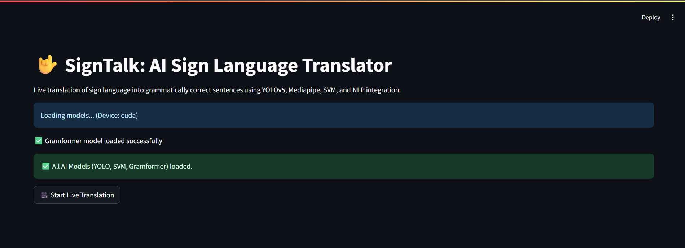
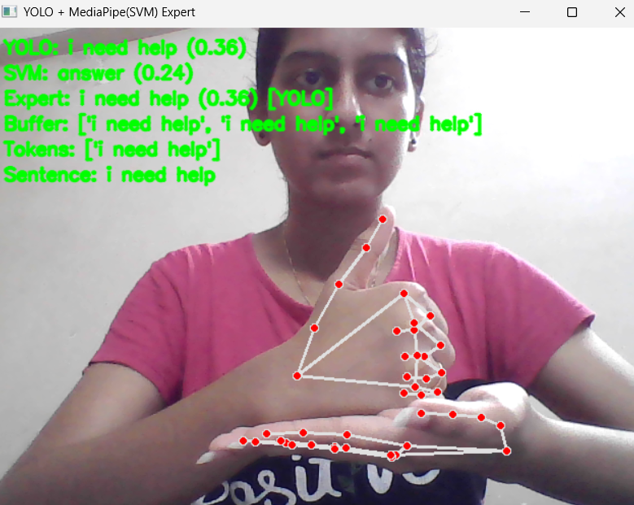

# SignTalk – Indian Sign Language Recognition System
### Real-time ISL recognition using YOLOv5, SVM, and NLP
> 🚀 A real-time AI system that translates Indian Sign Language into grammatically correct sentences using hybrid ML + DL.

---

## 📌 Problem Statement
Sign language is the primary mode of communication for millions of hearing-impaired individuals. However, real-time translation systems are limited, often requiring expensive hardware or human interpreters.

This project aims to build an **accessible, real-time Indian Sign Language (ISL) recognition system** that can translate gestures into meaningful text and sentences.

---

## ✨ Features
- Real-time sign language recognition using webcam  
- Hybrid YOLOv5 + SVM prediction system  
- Sentence formation using NLP (Gramformer)  
- Automatic model loading from compressed files  
- Interactive Streamlit interface

---

## ⚙️ Methodology
The system is built as a **hybrid expert system** combining classical machine learning and deep learning:

### 🔹 YOLOv5 (Deep Learning)
- Real-time hand gesture detection and classification  
- Trained on a custom dataset of ISL gestures  
- Handles spatial and contextual understanding  

### 🔹 SVM + MediaPipe (Machine Learning)
- Extracts **21 hand landmarks (63 features)** using MediaPipe  
- Uses SVM with RBF kernel for classification  
- Efficient and fast for real-time prediction  

### 🔹 Expert System
- Combines predictions from YOLOv5 and SVM  
- Selects output based on confidence scores  
- Improves overall robustness and accuracy  

### 🔹 NLP Integration
- Uses **Gramformer** to convert predicted word sequences  
- Generates grammatically correct sentences  

---

## 🧪 Recommended Environment

This project works best with:

- Python 3.8 – 3.10  
- GPU (optional, for faster YOLOv5 inference)

Create a virtual environment:

```bash
py -3.8 -m venv signtalk_env
signtalk_env\Scripts\activate
```

---

## ⚠️ Important Notes

- This project requires **Python 3.8–3.10**
- Python 3.11+ may cause issues with MediaPipe
- Webcam access is required for real-time detection

---

## ⚙️ Installation

```bash
pip install -r requirements.txt
```

---

## ▶️ Run the App

```bash
streamlit run signtalk.py
```

---

## 🛠️ Troubleshooting

### MediaPipe Error
If you see: AttributeError: module 'mediapipe' has no attribute 'solutions'

Fix:
```bash
pip uninstall mediapipe -y
pip install mediapipe==0.10.33
```

### Gramformer Not Installing

Fix:
```bash
pip install git+https://github.com/PrithivirajDamodaran/Gramformer.git
```


## 🧠 System Architecture
The system integrates:
- YOLOv5 → Detection  
- MediaPipe → Landmark extraction  
- SVM → Classification  
- Expert System → Decision fusion  
- Gramformer → Sentence generation

---

## 📊 Dataset
- 82 ISL word classes  
- 809 original images  
- Augmented to 3× dataset size  
- Annotated using Roboflow  

---

## 📈 Results
- YOLOv5 Accuracy: ~97%  
- SVM Accuracy: ~96%  
- Expert System: Improved overall reliability  
- Real-time gesture recognition achieved  

---

## 🛠️ Tech Stack
- Python  
- PyTorch (YOLOv5)  
- OpenCV  
- MediaPipe  
- Scikit-learn (SVM)  
- Gramformer (NLP)  
- Streamlit (UI)

---

## 🚀 Key Contributions
- Hybrid AI system combining ML + DL  
- Real-time continuous word recognition  
- Sentence-level translation using NLP  
- Custom ISL dataset creation  

---

## 📦 Model Files

Due to GitHub file size limitations, model files are provided as ZIP archives:

- `best.zip` → YOLOv5 trained model
- `svm_mediapipe.zip` → SVM classifier

These will be automatically extracted when the app runs.

---

## 📸 Demo





---

## 🔮 Future Work
- Expand dataset with more ISL vocabulary  
- Improve real-time performance  
- Deploy as web/mobile application

---

## ⚠️ Note

- Model files are compressed due to GitHub size limits  
- They will be automatically extracted during runtime  
- Ensure your webcam is enabled for real-time detection

---

## 📜 License
This project is licensed under the MIT License.

This project is an enhanced version of an existing work. Proper credit has been given in the acknowledgements section.

---

## 🙏 Acknowledgement

This project is based on and inspired by the research work:

"Continuous word level sign language recognition using an expert system based on machine learning"
by R. Sreemathy et al.

This implementation extends the original work by:
- Using YOLOv5 instead of YOLOv4
- Real-time Streamlit deployment
- Improved model integration and usability

All credit for the core methodology goes to the original authors.

---
